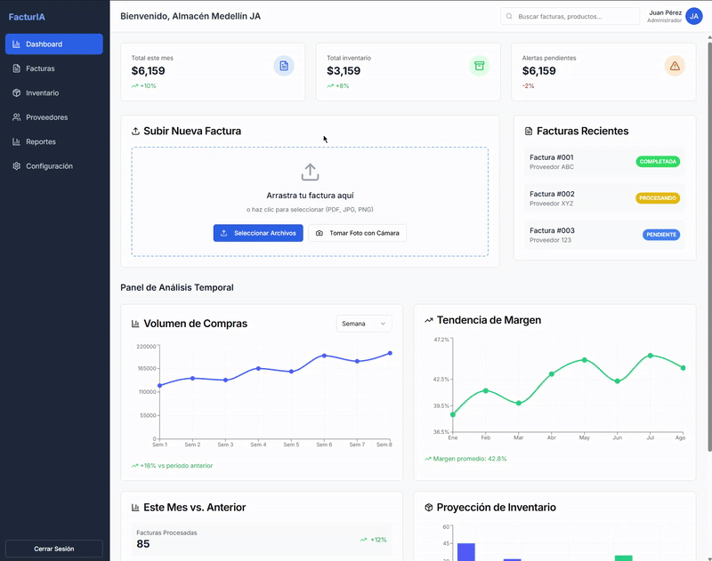

# 🚀 Invoice Processing SaaS for Colombian Retail

[](https://python.org)
[](https://aws.amazon.com)
[](https://fastapi.tiangolo.com)
[](https://docker.com)
[](https://aws.amazon.com/cdk/)

> B2B SaaS system that automates invoice processing using **AWS Textract + Computer Vision + ML** for liquidation stores and small-to-medium retail businesses in Colombia.

## 📊 Project Status

✅ **Functional MVP:** End-to-end invoice processing with manual pricing  
🔄 **In development:** Anti-duplicates + POS integrations  
🎯 **Next milestone:** Paying customer (2 months)

## 🏗️ Technical Architecture

### Tech Stack:
- **Backend:** FastAPI + PostgreSQL + SQLAlchemy
- **AI/ML:** AWS Textract + OpenCV + Transformers (Zero-shot classification)
- **Cloud:** AWS S3 + LocalStack (development)
- **Database:** PostgreSQL with Docker
- **Computer Vision:** OpenCV + img2pdf for mobile photos

### Processing Pipeline:
```bash
📱 Mobile Photo → 🔧 OpenCV Enhancement → 📄 PDF → 🤖 AWS Textract → 📊 Structured Data → 🗄️ PostgreSQL
```

## 🎥 Demo

[](https://www.loom.com/share/50c6c3d7085e43c5916b248c4d485463?sid=c7f60638-c20e-4239-847c-f5a5014ad227)

*click on GIF to see complete video*


## 🎯 Implemented Features

### Core Features ✅
- ✅ **Invoice upload:** Direct PDF + mobile photos with enhancement
- ✅ **ML processing:** AWS Textract + Computer Vision pipeline
- ✅ **Manual pricing:** Interface for setting sale prices with margin calculation
- ✅ **Multi-tenant:** Support for multiple clients
- ✅ **Basic analytics:** Processed invoice reports

### ML & Intelligence ✅
- ✅ **Product Classification:** Zero-shot learning for product categorization
- ✅ **Smart Pricing:** Recommendations based on category + historical data
- ✅ **Price Rounding:** Intelligent rounding (10,800 → 11,000)
- ✅ **Anti-Duplicates:** Fuzzy matching detection system (90% threshold)

### Integrations 🔄
- 🔄 **Square POS:** API integration (in development)
- 🔄 **Excel Export:** Automatic file generation
- 🔄 **Mayasis POS:** Client-specific integration (next)
- 🔄 **Webhook/API:** Generic system for custom integrations

## 🚀 Quick Start

### Prerequisites:
- Python 3.11+
- Docker & Docker Compose
- AWS Account (for Textract)

### Setup:
```bash
# 1. Clone repository
git clone https://github.com/EdwLearn/aws-document-processing.git
cd aws-document-processing

# 2. Setup environment
python -m venv venv
source venv/bin/activate  # Linux/Mac

# 3. Install dependencies
pip install -r requirements.txt

# 4. Start database
docker-compose up -d postgres

# 5. Configure environment variables
cp .env.example .env
# Edit .env with your AWS credentials

# 6. Run migrations
alembic upgrade head

# 7. Start server
uvicorn src.api.main:app --reload --host 0.0.0.0 --port 8000
```

## Quick Testing:
```bash
# Test ML Classification
curl -X POST "http://localhost:8000/api/v1/invoices/test-ml-classification" \
  -H "x-tenant-id: test" \
  -H "Content-Type: application/json" \
  -d '["Nike shoes", "Cotton t-shirt", "Bluetooth headphones"]'

# Test price rounding
curl -X POST "http://localhost:8000/api/v1/invoices/test-price-rounding" \
  -H "x-tenant-id: test" \
  -H "Content-Type: application/json" \
  -d '[10800, 15300, 1250, 450]'
```

##📡 API Endpoints
### Invoice Processing:
```bash
POST   /api/v1/invoices/upload              # Direct PDF
POST   /api/v1/invoices/upload-photo        # Mobile photo + enhancement
GET    /api/v1/invoices/{id}/status         # Processing status
GET    /api/v1/invoices/{id}/data           # Extracted data
```
### Smart Pricing:
```bash
GET    /api/v1/invoices/{id}/pricing        # Data for manual pricing
POST   /api/v1/invoices/{id}/pricing        # Set sale prices
POST   /api/v1/invoices/{id}/confirm-pricing # Confirm and update inventory
```
### Anti-Duplicates (Coming):
```bash
POST   /api/v1/invoices/{id}/check-duplicates   # Detect similar products
POST   /api/v1/invoices/{id}/resolve-duplicates # Resolve conflicts
```
### Integrations (In development):
```bash
GET    /api/v1/integrations/                # List integrations
POST   /api/v1/integrations/sync-inventory  # Sync to external systems
```
##🗄️ Database Structure
**Main Tables:**

- tenants - Multi-tenant clients
- processed_invoices - Processed invoices with metadata
- invoice_line_items - Invoice products with pricing
- products - Product catalog for inventory
- suppliers - Supplier directory

## Schema example:
```bash
sqlprocessed_invoices:
  ├── id: UUID (PK)
  ├── tenant_id: VARCHAR(100) 
  ├── status: uploaded | processing | completed | failed
  ├── pricing_status: pending | partial | completed | confirmed
  ├── invoice_number, supplier_name, total_amount
  └── textract_raw_response: JSONB

invoice_line_items:
  ├── id: UUID (PK)
  ├── invoice_id: UUID (FK)
  ├── product_code, description, quantity, unit_price
  ├── sale_price: NUMERIC(15,2)     -- Manual price
  ├── markup_percentage: NUMERIC(5,2) -- Calculated margin
  └── is_priced: BOOLEAN            -- Pricing flag
```

# 🤖 ML Features
## Product Classification:
```bash
python# Automatic product classification
"Nike Air Max shoes size 42" → {
    'category': 'shoes',
    'confidence': 0.94,
    'margin_percentage': 55.0,
    'reasoning': 'ML classified as footwear'
}
```
## Smart Pricing:
```bash
python# Intelligent price recommendations
cost_price = 28000 → {
    'recommended_price': 43000,  # Colombian rounded
    'confidence': 0.89,
    'margin_percentage': 53.6,
    'reasoning': 'Footwear category + supplier pattern'
}
```
## Anti-Duplicates:
```bash
python# Similar product detection
"Nike AirMax 42" vs "Nike Air Max shoes size 42" → {
    'similarity_score': 0.92,
    'is_duplicate': True,
    'price_difference': -7000,  # New supplier 15% cheaper
    'recommendation': 'Better supplier found'
}
```

Value Proposition:

- ⚡ Speed: 15 min → 2 min per invoice
- 🎯 Accuracy: >95% with Colombian invoices
- 💰 ROI: 300%+ documented
- 🔄 Integration: Connects with existing POS

## 📋 Roadmap
**This Week:**

- Anti-duplicates with fuzzy matching
- Auto-update inventory on pricing confirmation
- UX panel for duplicate resolution

**Next 2 Weeks:**

- Mayasis integration (CSV upload)
- Improved pricing frontend
- Staging deployment for client

**Month 2:**

- Square POS integration
- Advanced analytics dashboard
- "Almacén Medellín JA" onboarding

## **🔧 Configuration**
Environment Variables (.env):
```bash
# Database
DB_HOST=localhost
DB_PORT=5432
DB_NAME=document_processing
DB_USER=postgres
DB_PASSWORD=postgres

# AWS
AWS_REGION=us-east-1
S3_DOCUMENT_BUCKET=invoice-saas-textract-dev

# API
API_HOST=0.0.0.0
API_PORT=8000
ENVIRONMENT=development
```
Docker Services:
```yaml
# docker-compose.yml includes:
- PostgreSQL 15 (port 5432)
- Redis (port 6379) 
- LocalStack (AWS simulation, port 4566)
```
🐛 Known Issues
Dependencies:
```bash
bash# SQLAlchemy conflict - use specific versions:
pip install "sqlalchemy>=1.4.42,<1.5" "databases>=0.8.0" "alembic>=1.13.1"
```
## **Performance:**
- First ML load: 2-5 minutes (model download)
- After: <1 second
- Textract: 15-30 seconds per invoice

## 🤝 Contributing
Commit structure:
```bash
feat: new feature
fix: bug fix  
docs: documentation
refactor: code refactoring
test: add tests
```

**Development workflow**:

- Fork the repo
- Feature branch: git checkout -b feature/new-feature
- Commit: git commit -m "feat: description"
- Push: git push origin feature/new-feature
- Pull Request

## 📊 Metrics
**Technical**:

- Accuracy: >95% Colombian invoices
- Processing time: <30s per invoice
- API response: <200ms query endpoints
- Uptime: 99.9% (target)
